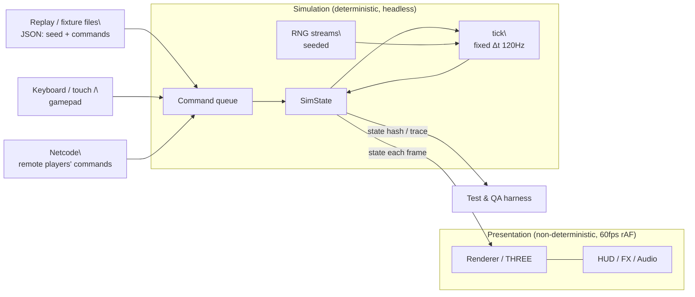

# ADR-0003: Deterministic simulation core (fixed timestep, command queue, seeded RNG)

- **Status:** Accepted
- **Date:** 2025-08-26 (session)

## Context

Today the whole game advances inside one `requestAnimationFrame` callback:

- `dt = Math.min(clock.getDelta(), 0.05)` — *variable* frame-rate dt (Game.ts:366),
- `Math.random()` reached *inside the simulation* (item roulette `Items.ts:198`,
  AI decision jitter `AI.ts:54`),
- presentation (particles, HUD roulette, DOM timers via `setTimeout`) is
  interleaved with simulation in the same call graph.

Consequences: the same input sequence produces different races run-to-run;
tests can only assert qualitative invariants; there is no replay, no
deterministic fixture, no testable time control, and no substrate for
netcode (remote inputs can't be replayed against a divergence-free state).

## Decision

Introduce a **headless-capable simulation core** (`src/sim/`) with four rules:

1. **Fixed timestep.** The sim advances only in steps of `TICK_MS = 1000 / 120`
   via an explicit `advance(ticks)` API. It never reads a wall clock. The
   presentation layer runs a free rAF loop and a decoupled accumulator feeds
   the sim; rendering interpolates between the last two sim states.
2. **Command queue, not polled devices.** All player influence enters as
   `Command { tick, seq, playerId, kind, data }` records pushed into a
   per-tick queue before `tick()` runs. `InputFrame` (already serialisable:
   `steer/throttle/brake/itemPressed/itemHeld` — Input.ts:4) becomes the
   data payload of `PLAYER_INPUT` commands. The sim consumes each queue
   exactly once and errors on commands for past ticks (late = never applied).
3. **Seeded, stream-split RNG.** A `Rng` facade over `SFC32`/`mulberry32`
   replaces `Math.random` inside sim code, with one independent stream per
   subsystem (`rng.stream('ai')`, `rng.stream('items')`) so adding a new
   consumer never renumbers existing streams. Presentation keeps its own
   unseeded stream for pure eye-candy.
4. **Snapshot-able state.** Sim state is plain data (structurally serialisable;
   `x/y/z/yaw` numbers, ids instead of object refs). `snapshot()` /
   `restore()` support fixtures, "resume the race at tick 5,000", and
   host→guest state transfer on join.

Determinism contract (enforced by tests): *step-for-step, the same initial
snapshot + same command trace + same seed ⇒ bit-identical state hashes.*

## What moves where (target shape)

| Today (src/game)            | v2 home                              |
| --------------------------- | ------------------------------------ |
| Kart physics (Kart.update)  | `sim/kart.ts` (pure step)            |
| Items logic (box pickup, roulette roll, banana/mushroom/star) | `sim/items.ts` |
| AI steering/decisions       | `sim/ai.ts` (uses seeded stream)     |
| Collision + respawn + lap logic | `sim/rules.ts`                   |
| Track sampling (Catmull-Rom, distances, worldToTrack) | `sim/track.ts` (already pure) |
| KartVisual, Effects, HUD, Audio, RacerPreview | stay `game/`, consume sim state |

## Consequences

- `Kart` loses its `THREE.Vector3`/`visualRoot` coupling: sim karts become
  plain records; a small adapter mirrors them into THREE objects for display.
- `setTimeout` in the race path (final-lap callout, GO! fade) moves to
  tick-timed events; presentation animates from those, never schedules itself.
- The existing 24 vitest tests keep passing during the migration (they import
  pure modules that stay put), then the sim gains its own deterministic suite.
- "controllable time" falls out for free: `advance(n)` = run n ticks instantly;
  a test can jump to tick 12,000 (t=100s), inject a command, and step once —
  that is the mechanism behind fixtures and scenario demos.