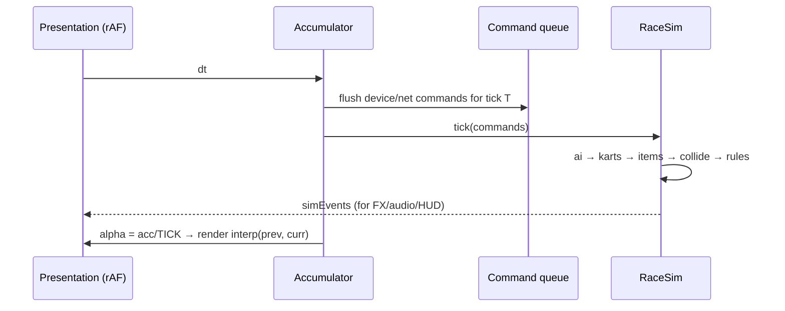

# Architecture

One page showing where Kart Kingdom came from, where it is going, and the
boundary between the two. Companion docs: ADR-0003 (deterministic core),
ADR-0004 (multiplayer boundaries), simulator.md (the contract), multiplayer.md
(the handbook).

## The three layers we are building to

```mermaid
flowchart TB
    subgraph L3["Layer 3 · EXPERIENCE (browser shell, art, audio, UI)"]
        REN[Renderer: THREE scene, camera, FX] --- HUD --- AUD[Audio]
        INP[Input devices] --- MENU[Menus, lobby, chat UI]
    end
    subgraph L2["Layer 2 · NETWORK"]
        NC[NetController] --- TR[Transports: loopback | broadcast | webrtc]
    end
    subgraph L1["Layer 1 · SIMULATION (headless, deterministic)"]
        SIM[RaceSim.tick(commands)] --- TRK[Track sampler] --- RNG[Seeded RNG]
    end
    INP & TR -->|commands| SIM
    SIM -->|state + events| REN & HUD & AUD & NC
```

**Rule:** Layer 1 imports nothing from Layers 2–3. Layer 2 sees state and
commands only. Layer 3 consumes state; it never mutates sim data in place.

## Current (v1) shape — being migrated

```
src/
  main.ts          bootstrap (DOM, THREE exposure for QA)
  config.ts        ALL tuning constants (typed) — stays the tuning source
  game/
    Game.ts        state machine + frame loop + sim glue + camera (~40% sim work)
    Kart.ts        arcade physics; state in THREE.Vector3 + visual attached
    AI.ts          rubber-band line follower (Math.random jitter)
    Items.ts       boxes, roulette (Math.random), banana/mushroom/star
    KartVisual.ts  procedural kart + driver meshes
    Effects.ts     pooled GPU particles (visual-only Math.random — OK)
    HUD.ts         DOM overlay incl. minimap, menus, roulette
    Input.ts       keyboard/touch/gamepad → InputFrame (already serialisable)
    Audio.ts       synthesis-only WebAudio
    RacerPreview.ts menu preview scene
    minimap.ts     polyline helper
  track/track.ts   Catmull-Rom loop, terrain, ribbon road, props (pure math)
  editor/          track editor (custom levels via localStorage)
tests/             24 vitest: input, config, track, kart
scripts/           headless QA (Chrome): qa.mjs, vqa.mjs
```

Bones are good: `InputFrame` is a command; `track/` is pure; `config.ts` is a
single tuning surface; the diag JSON already makes the sim observable
headlessly. The debts are: variable-dt sim interleaved with rendering
(`Game.ts`), `Math.random` in item roulette + AI, sim state living in THREE
objects, and one god-object orchestrator. Migration target + steps: ADR-0005.

## Target (v2) shape

```
src/
  sim/             deterministic core (no three/DOM/audio imports)
    RaceSim.ts     tick(), snapshot(), restore(), hash(), events
    types.ts       Command[], RaceState, KartState, ItemState (schema v1)
    kart.ts        kart step (physics from Kart.ts, state decoupled)
    items.ts       boxes, roulette (seeded), hazards (from Items.ts)
    ai.ts          AI brains (seeded jitter; per-agent streams)
    rules.ts       collision, respawn, lap/position, finish
    track.ts       moved from track/track.ts (unchanged, now shared)
    rng.ts         SFC32 streams
    fixture.ts     load/playback of scenario fixtures (JSON)
    protocol.ts    snapshot/serialise/hash, version checks
  net/             netcode (ADR-0004)
    NetController.ts   lobby, session, snapshot streaming, events
    transports/    loopback.ts | broadcast.ts | webrtc.ts | manualSignal.ts
  game/            thin shell: rAF + accumulator → sim.tick; adapters
    Renderer.ts    scene/camera/kart-mesh adapter (reads sim state)
    …HUD/Effects/Audio/Input (as today, now state-driven)
  session/         room UI: name, lobby, chat, migrate, results
tests/             unit + property + determinism + golden (simulator.md §7)
fixtures/          JSON scenarios (seed + commands + asserts)
```

## Data flow of one tick (target)



## What stays where (boundaries in one line each)

- **config.ts** — numbers only; sim reads it, shell reads it; never mutated at runtime (fixturable overrides via `createRace(tune)`).
- **sim/** — pure data in/out; the only place game rules live.
- **net/** — translates transport bytes ↔ commands/snapshots/events; knows nothing about rendering.
- **game/** — devices, DOM, art; knows nothing about transport.
- **fixtures/** — shared truth for tests, QA and demos.