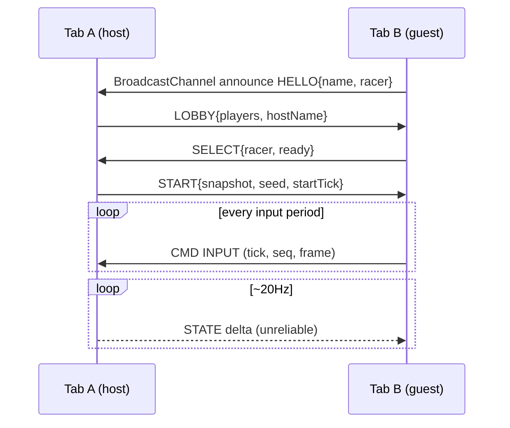
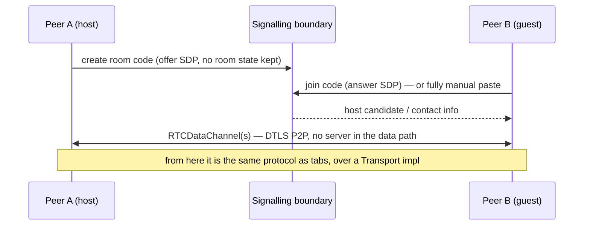
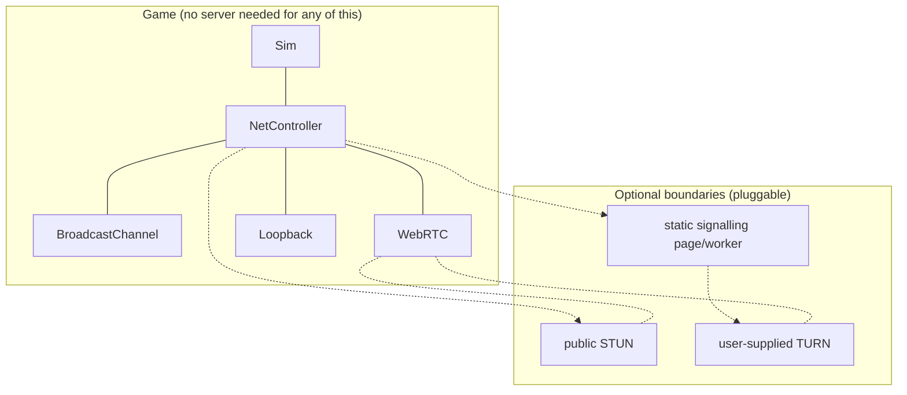
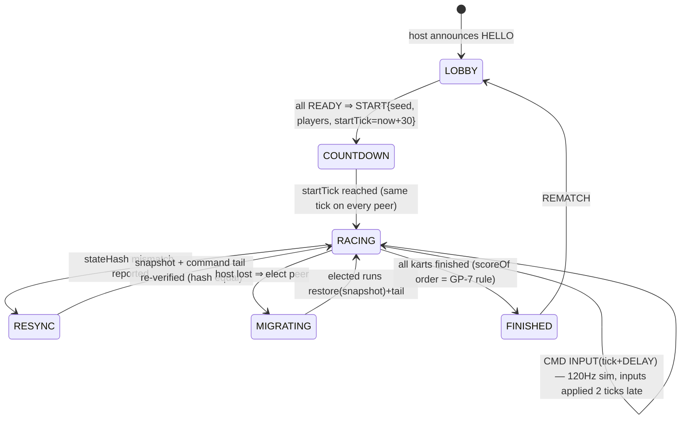

# Multiplayer handbook — flows, boundaries, message catalogue

Companion to ADR-0004 (transport + boundaries) and ADR-0003 (deterministic
core). This page is the operating manual for the multiplayer experience:
what players see, and what bytes cross which boundary to make it happen.

## 1. What "modern fun multiplayer" means here (product bar)

- Race friends **with zero accounts and zero infrastructure**: same-browser
  tabs, or cross-device room codes over P2P data channels.
- Up to 8 racers: humans + AI backfill, with late-join and reconnect.
- A real lobby: name, racer select, ready-up, track vote, chat/emotes.
- In-race socials: quick-chat wheel, emote sparks, live positions, item events.
- After the race: podium with names, rematch, "next track" handover.
- **Split-device play**: 2 players, one keyboard (P1: WASD, P2: arrows) and
  hot-seat via loopback transport — the deterministic sim makes this trivial.

## 2. Session flows

### Same-browser tabs (zero server, zero setup)

One origin is all it takes — `BroadcastChannel` carries both control
(reliable) and state (we emulate unreliability by dropping old frames).

### Cross-device P2P (WebRTC data channels)

The signalling boundary is *at most* a stateless static page/worker that
couples an offer to an answer by room code (no accounts, no persistence,
delete-after-use). With `ManualSignalling`, even that goes away: host copies a
blob, friend pastes it.

### Reconnect & host quit

- Guest drop >5 s → host keeps racing with that kart on **AI backfill**
  (deterministic AI takes over — same sim, new command source).
- Guest returns (`REJOIN` with session id) → receives `snapshot + command tail`,
  seamlessly continues.
- Host quits → guests hold the last snapshot, elect the lowest-latency peer,
  run `restore(electedSnapshot)` and continue (deterministic migration);
  failure → everyone keeps racing with AI of the departed host's racer.

## 3. Message catalogue (protocol v1)

| Message | Dir | Channel | Payload (v) |
| ------- | --- | ------- | ----------- |
| `HELLO` | g→h | reliable | name, racer, protocol v |
| `LOBBY` | h→g | reliable | player list, host, track picks |
| `READY` | g→h | reliable | bool |
| `START` | h→g | reliable | snapshot seed, start tick, racer assignment |
| `CMD INPUT` | g→h | reliable | Command (see simulator.md §3) |
| `STATE` | h→g | unreliable | compact snapshot delta @20Hz |
| `EVENT` | h→g | reliable | item used, lap, boost, hit, chat, emote |
| `REJOIN` | g→h | reliable | session id |
| `MIGRATE` | h→g | reliable | snapshot + full command tail + rng state |
| `KICK`/`BYE` | either | reliable | reason |

Channels: one reliable-ordered `RTCDataChannel` (control + inputs + events)
and one unreliable-unordered (state). Same split is emulated on
BroadcastChannel (freshness filter) and fused on Loopback.

## 4. Boundaries — the one-page picture

Playing with a friend on the same Wi-Fi needs **nothing optional**: WebRTC
with host candidates usually connects LAN-device-to-LAN-device without STUN.
Same-browser tabs need not even that. Cross-internet play tries STUN (public,
free, stateless); if the NAT eats it, the room owner may supply a TURN — the
only case where "a server system" exists, and it is outside our trust boundary
by design.

## 4b. Lockstep operation — the judge amendment, now concrete (M3 spec)

Per the binding **ADR-0004 amendment**: deterministic **lockstep with a
2–3 tick input delay is PRIMARY**; host-snapshots exist only for join/resync/
migrate/mixed-engine fallback. The host is an **authoritative coordinator**,
not a simulator-of-record — every peer runs the identical sim locally and
advances only on agreement.

Tick cadence rules (all primitives already exist in M1):

1. Every peer simulates `Game.#simUpdate` at exactly `TICK_MS = 1000/120`.
2. Local keyboard → `CMD INPUT` for tick `T+2` (2-tick delay buffer; T+3 under
   measured round-trip > 60ms). Inputs for a tick are closed at that tick —
   missing input ⇒ neutral frame (never a stall).
3. Each peer computes `stateHash(snapshotRace())` per tick and exchanges it on
   the reliable channel at 20Hz (every 6th tick). A mismatch ⇒ RESYNC flow:
   the host's snapshot + its command tail are applied (`applyKartSnapshot`
   + ItemsSim), and the hash is re-checked before continuing.
4. Events (`EVENT` sfx/particles/emotes/chat) replay from the SimEventQueue —
   presentation only, never authoritative state.
5. **Same-engine room gate**: while `worldToTrack` still carries transcendental
   terrain math, room codes gate on the engine signature in `HELLO`
   (`engine: 'kk-webgl@'+protocolVersion`); a cross-engine join falls back to
   snapshot-follow mode (host STATE @20Hz) until J-23/J-26 replace the
   transcendentals with polynomial approximations.
6. The **host may not command its own simulation differently** from guests —
   host inputs enter the same command queue, with the same delay. Authority
   means: START/RESYNC/KICK/MIGRATE and item-box truth on join, not per-tick
   state truth.

## 5. Cheating & trust

Friends-racing posture: the host's word is final (items, positions, finish
times). Guests cannot inject state. A room code is a shared secret, not an
identity. We keep the surface boring: no persistent IDs, no leaderboards
beyond local bests, no global chat.

## 6. Milestone definition (for the judge)

"Modern fun multiplayer experience, few/no servers" is met when **all** hold:

1. Two tabs, one browser: full race, positions, items, chat, no flags.
2. Two devices, one Wi-Fi, via room code (or manual blobs): same.
3. AI backfills a dropped player; the race never stalls.
4. Rematch + next-track flow exists.
5. Everything above runs from the same deterministic sim that powers tests.